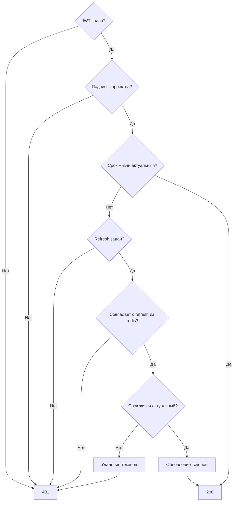

```mermaid
flowchart TD
    1{JWT задан?}
    1 --> |Нет| 2[401]
    1 --> |Да| 3{Подпись корректна?}
    3 --> |Нет| 2
    3 --> |Да| 4{Срок жизни актуальный?}
    4 --> |Нет| 5{Refresh задан?}
    4 --> |Да| 6[200]
    5 --> |Нет| 2
    5 --> |Да| 7{Совпадает с refresh из redis?}
    7 --> |Нет| 2
    7 --> |Да| 8{Срок жизни актуальный?}
    8 --> |Нет| 9[Удаление токенов]
    8 --> |Да| 10[Обновление токенов]
    9 --> 2
    10 --> 6
```
